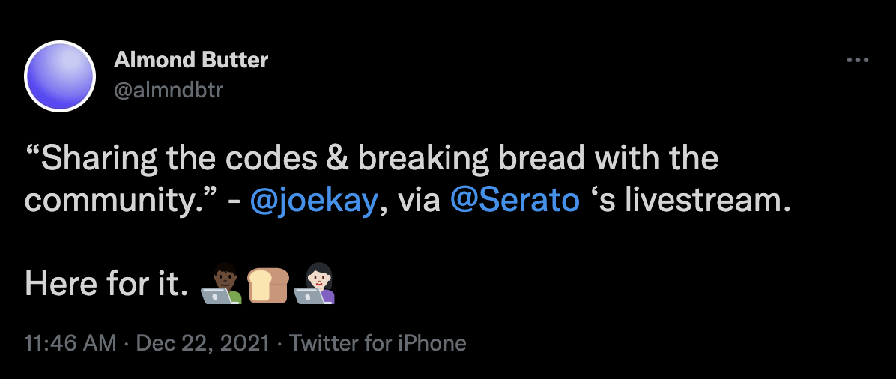

# 📓 Almond's Field Notes

These are Almond's field notes on web3 crypto.

### Why this exists

I started this online publication to track what I'm learning and teaching it to anyone's who's curious about the space. I even tweeted about it after listening to @joekay's interview with Serato!

(Forgive my misplaced apostrophe. :see\_no\_evil:)

Thanks `@joekay` and the Soulection team for encouraging folks to share the codes and break bread with the community. As a long-time listener and software engineer, I'm here for it. :man\_technologist::bread::woman\_technologist:

### Process

* 🤔Start: when I have an idea, I'll create a new item in the [`Field Notes` project board](https://github.com/users/almndbtr/projects/1) and add any relevant labels. If I have no ideas, I'll work through my own backlog or ask my friends what they're curious about.
* 🙆‍♂️Next: when I'm ready to work on an idea, set its status to `In Progress`.
  * :grapes:In the issue, I'll spike out a list of tasks of what I want to explore.
  * :pencil2:Using Gitbook's interface, I'll just write a sloppy first draft to get it all out there (brain dump). When it's "good enough", I'll merge it in, read it in production, and find areas to iterate and work on.
* :relieved:Finish: when I think that it's gone through enough iterations after self-review and peer-review, I close out the issue with a comment.

### Contributing

Thank you for investing your time in contributing to our project! Any contribution you make will be reflected on [https://field-notes.almndbtr.dev](https://field-notes.almndbtr.dev) ✨.

Please read the [Code of Conduct](CODE\_OF\_CONDUCT.md) to keep this project's community approachable and respectable.

At this time, I'm only reviewing reported [typographical errors](https://en.wikipedia.org/wiki/Typographical\_error) and their fixes. I will politely decline any new work.

### **Special thanks**

* My high school English teacher, Mrs. G
* My university's Writing Center reviewers
* My work colleagues: 🌹, 🐦🚗, :woman\_pilot::blueberries:
* [@julian](https://twitter.com/julian)'s[ Writing Well](https://www.julian.com/guide/write)
* [@jnraine](https://twitter.com/jnraine)'s [`Refactoring: A Developer's guide to writing`](https://www.youtube.com/watch?v=BbIILUSmSk4)

### License

[The Hippocractic License](https://firstdonoharm.dev)

### Legal Disclosures

**tl;dr | **_**This is not financial advice. Please do your own research and consult with your financial or investment advisor(s) before making any decisions.**_

\
_Past performance is not indicative of future results. I do not guarantee any specific result (profits or losses). Please be aware of the real risk of loss in following any strategy or investment discussed here. Strategies or investments discussed may fluctuate in price or value. Investors may get back less than invested. Investments or strategies mentioned may not be the right thing This material does not take into account your particular investment objectives, financial situation or needs and is not intended as recommendations appropriate for you. You must make an independent decision regarding investments or strategies mentioned. Before acting on anything in this post, you should consider whether it is suitable for your particular circumstances and strongly consider seeking advice from your own financial or investment advisor(s)._

[\
](https://viewblock.io/arweave/tx/SQ6H3CZpgiAA-JHbGO8PrYHoo2\_oRwYa4DGbJh76dDk)
