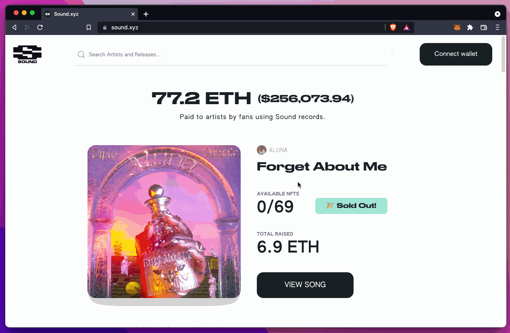

# 🦊 Metamask

I wrote this section after the `New? Start here` page because if you are interested in getting skin in the game, the best way to do that is to get a crypto wallet and start interacting with the blockchain. I chose MetaMask because that's what I started with, but I'd like to also offer a "primer" on using [Phantom](https://phantom.app) for the Solana blockchain given my fabulous experience with their crypto wallet.

\---

[MetaMask](https://metamask.io/about.html) is a global community of developers and designers dedicated to using blockchain technology to make the world a better place.

MetaMask’s main product is a crypto wallet. You can [download MetaMask](https://metamask.io/download.html) as a browser extension or as a mobile application (available for iOS and Android).

MetaMask markets their wallet as a “gateway” to blockchain applications. Put another way, a MetaMask wallet gives you a way to interact with applications that use the blockchain (by default, Ethereum blockchain) as a part of its core functionality. It’s possible to configure MetaMask to connect to other blockchains by using [custom networks](https://metamask.zendesk.com/hc/en-us/articles/360056196151-Using-custom-networks-with-MetaMask), but you may not need to depending on the applications that you’re most interested in using and the network(s) they support. Most popular applications us the Ethereum blockchain.

### Getting Started

MetaMask has [extensive documentation for getting started](https://metamask.zendesk.com/hc/en-us).

These articles are foundational for using MetaMask, the basics of blockchains and Ehtereum, and getting started with using it:

* [User guide: secret recovery phrase, password, and private keys](https://metamask.zendesk.com/hc/en-us/articles/4404722782107-User-guide-Secret-Recovery-Phrase-password-and-private-keys)
* [Learn the basics of blockchains and Ethereum (miners and validators, gas, cryptocurrencies and NFTs, block explorer, networks, etc.)](https://metamask.zendesk.com/hc/en-us/articles/360015489611-Learn-the-basics-of-blockchains-and-Ethereum-miners-and-validators-gas-cryptocurrencies-and-NFTs-block-explorer-networks-etc-)
* [Getting started with MetaMask](https://metamask.zendesk.com/hc/en-us/articles/360015489531-Getting-started-with-MetaMask)

Once you’re finished with those, read up on any other guide that might pique your interest at `https://metamask.zendesk.com` .

### Using your wallet

Once you have a Metamask wallet, you can:

* Buy, store, send, and swap tokens. 🪙
* Explore blockchain apps. 🤖
* Own your data.

Let’s look at each of these features, one-by-one.

#### Buy, store, send, and swap tokens. 🪙

* **Buy:** To get ETH, you can follow MetaMask’s [`How to buy ETH`](https://metamask.zendesk.com/hc/en-us/articles/360058239311-How-to-buy-ETH) or you can direct deposit (or receive) tokens (like ETH) to your MetaMask wallet from a centralized exchange (like FTX, Coinbase, Binance, Crypto.com, or similar company).
* **Store**: Once you buy or deposit tokens, you can store them in your MetaMask wallet. You don’t have to do anything with them if you don’t want to.
* **Send**: check out [`How to send ETH and ERC-20 tokens from your MetaMask wallet`](https://metamask.zendesk.com/hc/en-us/articles/360015488931-How-to-send-ETH-and-ERC-20-tokens-from-your-MetaMask-wallet)``
* **Swap**: there are a number of protocols and applications for swapping tokens. Here are some dApps that you can check out to swap — use the one that best fits your needs or research their competitors and use them instead: [Uniswap](https://app.uniswap.org/#/swap), [1Inch Exchange](https://app.1inch.io), and [SushiSwap](https://www.sushi.com).

#### Explore blockchain apps. 🤖

[Sound.xyz](https://www.sound.xyz) is creating a platform for a more collaborative music movement, built on web3 technology and values. Users can support artists on the Sound.xyz platform directly by buying an artist’s music NFT.

(💁🏻‍♀️ Friendly disclosure: At this time of writing, I hold NFTs created by the [Sound.xyz](http://sound.xyz) team. I’m a super-fan of their company: we’ll use them as an example. If, at the end of this example you find that you like their work, follow [Sound.xyz](http://sound.xyz) on Twitter: [https://twitter.com/soundxyz\_](https://twitter.com/soundxyz\_))

Let’s say that one of your favorite artists is throwing a listening party with Sound.xyz. You’re jazzed and you want to support that artist by buying their music NFT.

So, you go to `https://sound.xyz`.&#x20;

The page loads and... you'll notice that they don't have a “Sign in” button with a “username” and “password” input to type in your credentials.

Instead, [Sound.xyz](http://sound.xyz) has a `Connect Wallet` button.

[Sound.xyz](http://sound.xyz) is not looking for the physical wallet you keep your cash and coin in. Neither are they looking for your credit card or your credentials to a payment provider like [PayPal](https://paypal.com), [CashApp](https://cash.app), or other financial conglomerate.

[Sound.xyz](http://sound.xyz) offers an option to connect your _crypto wallet_, like Metamask.

Go ahead and click `Connect Wallet` — you’ll be presented with the option to connect a MetaMask Wallet or one of the supported wallets in [WalletConnect](https://walletconnect.com):

Clicking `Connect Wallet` reveals options of which crypto wallet you’d like to connect to Sound.xyz:

(This guide will not cover how to use the supported wallets in WalletConnect.)

The [Sound.xyz](http://sound.xyz) platform includes an application that interacts with the Ethereum blockchain.

Once you connect your wallet, you can interact with the application, optionally connect your Twitter account, and attend one of their listening parties. If you like the song that this artist dropped, you can buy one of their music NFTs.&#x20;

From past experience, I have lost [my first bid](https://etherscan.io/tx/0xbffa8bfff33038975f4ef0a4dc7d4c7a1b8cbdcbe0e0fb639697f13f3318fcd1) and [my fourth bid](https://etherscan.io/tx/0x90d8bf2a386776e979a1cdc66543ff9073afbf1b2c614741f0e2fc444535141f) and it wasn't great losing the opportunity to purchase and spending those gas fees. But, I've had success by "the luck of the draw" and with "bumping" the gas fee to something higher than the "normal" suggested fee. This isn't financial nor tactical advice but offering a perspective (though, your mileage will certainly vary from mine).

#### Own your data.

Chris Dixon [once noted](https://twitter.com/cdixon/status/1442201621266534402) that web3 is:

“... an internet owned by users and builders, orchestrated with tokens.”

[Brave.com](http://brave.com)’s article, [What’s web3, and how do I access it?](https://brave.com/learn/what-is-web3/), offers a high-level overview into web3 and its ownership model. In addition, Andy Martin’s [Identity, ownership, & web3](https://www.linkedin.com/pulse/identity-ownership-web3-andy-martin) as well as Chase Chapman’s [Co-ownership as a web3 social primitive](https://mirror.xyz/chappy.eth/PjnfkklAMUcEIBQuZ-An5xlBheQchsLwkRx6GHPfGzw) might offer additional perspective.

Stepping back from these authors’ collective views, I look at web3 as a different means of interacting with applications, platforms, and protocols with other “clients” around the world. If we’re using MetaMask as a wallet, we do not need to give any personally identifiable information or any related data: all we need is our consent to sign a transaction and have that signature associated with our wallet’s address. I can have multiple wallets in addition to MetaMask and each of them can have their own purposes and tokens. My identity can “morph” or “shift” or “transform” in a sense, where I can switch which wallets can connect to whatever applications I so choose, and I’m only limited by myself around how much (or little) I choose to interact.

These are still “early days” - there will be more development to come and this space evolves quickly. Ownership may come to mean different things with these evolutions and it’s an exciting time to learn.
